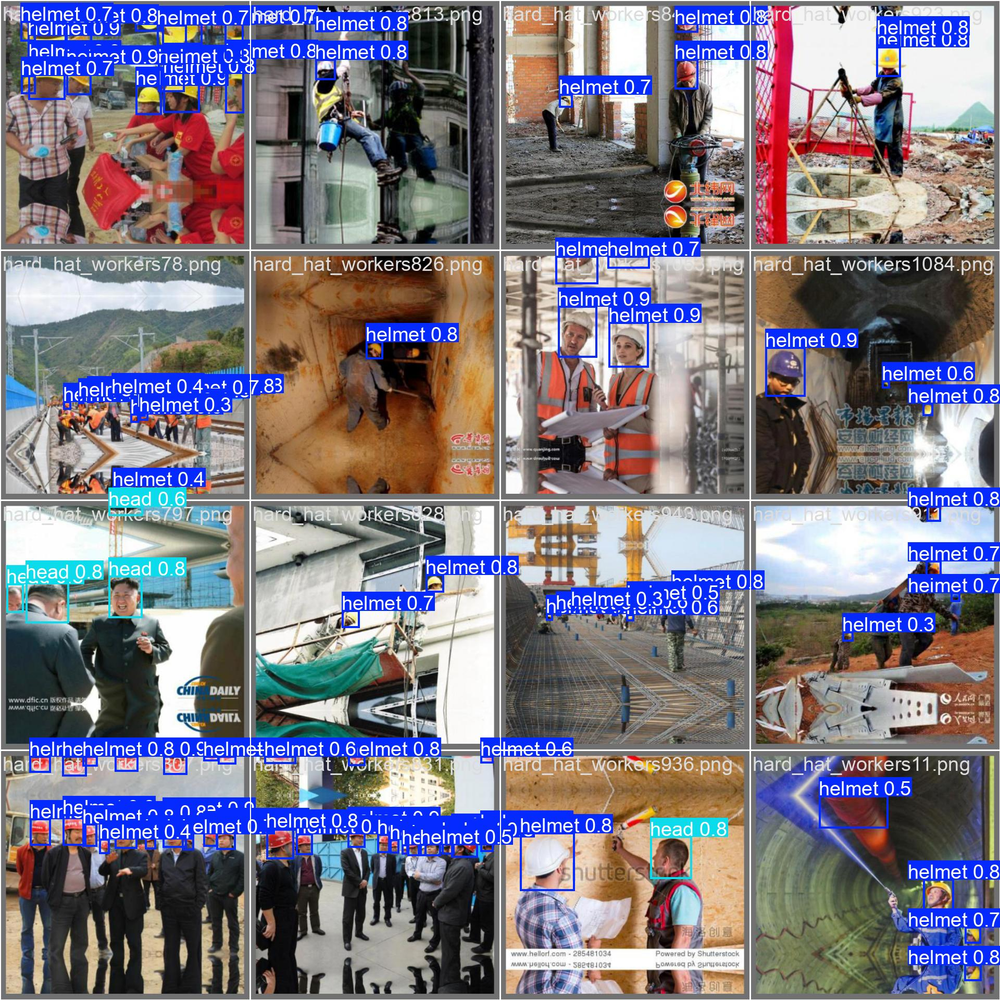

# 👷‍♂️ YOLOv8 Safety Helmet Detection

This repository contains a Computer Vision project focused on detecting safety helmets and people in workplace images. The project utilizes the YOLOv8 object detection model, fine-tuned on a custom dataset.

---

## ✨ Key Features:

*   **End-to-End Pipeline:** Covers dataset preparation, YOLOv8 model fine-tuning, comprehensive evaluation.
*   **YOLOv8 Object Detection:** Employs the cutting-edge YOLOv8s model from Ultralytics, fine-tuned for specific object detection (helmet, head, person).
*   **Custom Dataset Integration:** Demonstrates handling and preparing a custom dataset for YOLOv8 training.
*   **Professional Training:** Utilizes efficient training practices within the Ultralytics framework.
*   **Comprehensive Evaluation:** Provides detailed performance metrics (mAP50, Precision, Recall) and generates various visualizations (Confusion Matrix, F1-Curve, Sample Predictions).
*   **Model Export:** Exports the trained model to the ONNX format for wider compatibility and deployment scenarios.
*   **Robustness:** Addresses practical challenges related to environment setup and dependency management in cloud environments like Kaggle.

---

## 📚 Technologies Used:

*   **Object Detection Framework:** `Ultralytics YOLOv8`
*   **Deep Learning Frameworks:** `PyTorch` (underpins Ultralytics)
*   **Data Manipulation:** `Numpy`, `Pandas`
*   **Machine Learning Utilities:** `Scikit-learn`
*   **Computer Vision Utilities:** `Supervision`, `PyCOCOTools`
*   **Model Export:** `ONNX`
*   **Platform:** `Kaggle Notebooks`
*   **Logging & Visualization:** `Loguru`, `Rich`, `Matplotlib`
*   **Environment Management:** `Python venv`
*   **Version Control:** `Git`, `GitHub`

---

## 📂 Project Structure:

This repository contains the Jupyter Notebook source file and the generated output files from the training run.

```bash
.
├── yolo-safety-helmet-detection.ipynb # The Kaggle Notebook source file, containing all steps and outputs.
├── data.yaml                          # YOLOv8 dataset configuration file.
├── requirements.txt                   # List of all Python dependencies for the project.
├── runs/                              # Directory containing all training outputs, including model weights and plots.
│   └── detect/
│       └── train/                     # Specific run directory
│           ├── weights/               # Contains best.pt (PyTorch weights) and best.onnx (exported ONNX model)
│           ├── confusion_matrix.png   # Generated confusion matrix plot
│           ├── results.png            # Overall training results plot
│           ├── val_batch0_pred.jpg    # Example image with model predictions
│           └── ... (other plots and log files)
├── kaggle/                            # (Optional) Kaggle specific files from download.
├── yolov8s.pt                         # Base YOLOv8 model weights (pre-trained, downloaded during setup).
└── README.md                          # This project overview and documentation.
```


---

## ⚙️ How to Run Locally:

To view the full notebook and its outputs, it's recommended to run this project within Kaggle. If you wish to run parts of this project locally, you can:

**Prerequisites:**
*   Python 3.11 (recommended).
*   Git.
*   Visual Studio Code (or any preferred IDE/text editor).
*   **For Windows users:** Install [Microsoft C++ Build Tools](https://visualstudio.microsoft.com/visual-cpp-build-tools/).

**Setup Steps (for basic notebook execution and viewing outputs):**

1.  **Clone the repository:**
    ```bash
    git clone https://github.com/EmadAliEmad/YOLOv8-Safety-Helmet-Detection.git
    cd YOLOv8-Safety-Helmet-Detection
    ```

2.  **Create and activate a Python virtual environment:**
    ```bash
    py -3.11 -m venv venv_yolo   # On Windows
    source venv_yolo/bin/activate  # On macOS/Linux/Git Bash
    ```

3.  **Install the required dependencies:**
    ```bash
    pip install -r requirements.txt
    ```
    *(Ignore any `WARNING` messages about dependency conflicts unless they are `ERROR` preventing installation.)*

4.  **Open the Notebook:**
    Launch Jupyter Lab/Notebook (`jupyter lab` or `jupyter notebook`) from your terminal and open `yolo-safety-helmet-detection.ipynb`. You can then navigate through the cells to see the code, run specific parts, and explore the generated `runs/` directory for outputs.

---

## 📊 Results & Performance:

The YOLOv8s model achieved strong performance on the custom Helmet Detection test set after fine-tuning for 20 epochs.

*   **Overall mAP50:** ~0.637
*   **Helmet mAP50:** ~0.958
*   **Head mAP50:** ~0.910
*   **Person mAP50:** ~0.042 (Note: Lower performance for 'person' class is common in datasets with fewer instances or focus on other primary objects.)

**Visual Proof of Detections:**

Here's an example image from the validation set showing bounding box detections for helmets, heads, and persons.


*An example image from the validation set showing bounding box detections for helmets, heads, and persons. (Image path is relative to the repository root)*

**Evaluation Plots:**

You can find all generated evaluation plots and metrics in the `runs/detect/train/` directory within this repository. These include:
*   `confusion_matrix.png`: Visual representation of classification performance.
*   `results.png`: Overall training results plot (loss, mAP over epochs).
*   `F1_curve.png`, `BoxP_curve.png`, `BoxR_curve.png`: Detailed performance curves.
*   `results.csv`: CSV file containing detailed training metrics per epoch.

---

## 🚀 Future Enhancements:

*   **Increase Dataset Size/Quality:** Expand the dataset with more diverse images and improved annotations, especially for underperforming classes.
*   **Explore Other YOLO Models:** Experiment with larger YOLOv8 models (e.g., `yolov8m`, `yolov8l`) or other YOLO versions for potentially higher accuracy.
*   **Implement Advanced Evaluation:** Integrate more detailed analysis metrics and visualization.
*   **Build a User Interface:** Create a user-friendly web interface (e.g., with Streamlit, Flask) for easier interaction and real-time inference using webcam or uploaded images.
*   **Containerization & Cloud Deployment:** Package the application using Docker for easier deployment and portability to cloud platforms (e.g., Hugging Face Spaces, AWS EC2/Lambda, Google Cloud Run).
*   **Edge Deployment:** Optimize the model for deployment on edge devices for real-time processing in constrained environments.

---

## 📞 Contact:

*   **Your Name:** Emad Ali Emad
*   **LinkedIn:** [[Your LinkedIn Profile URL](https://www.linkedin.com/in/emad-ali-emad-886647199/)]
*   **Email:** [emadaliemad375@gmail.com]

---
```
